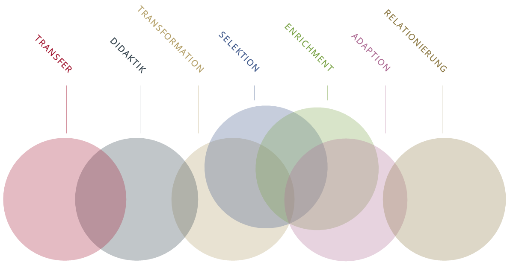
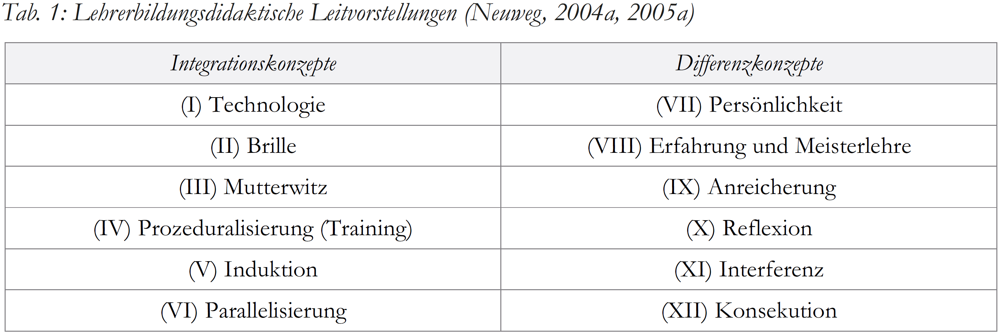
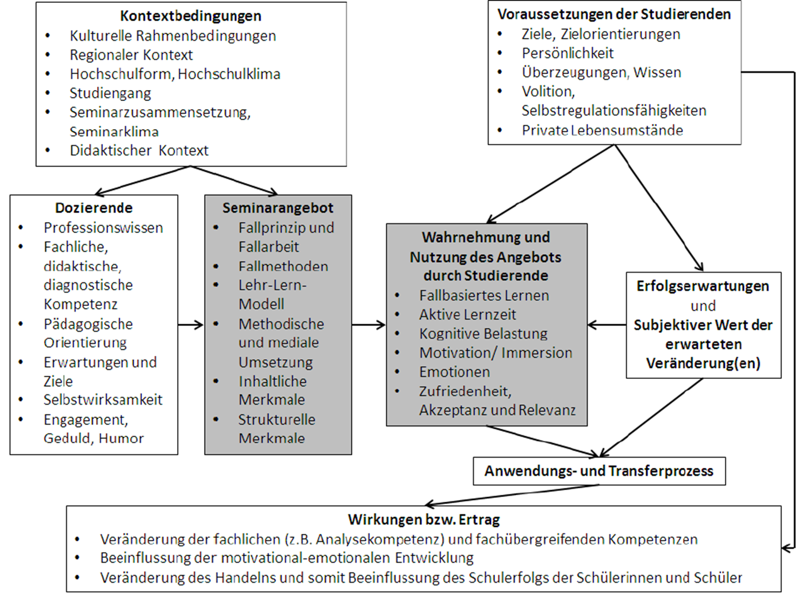
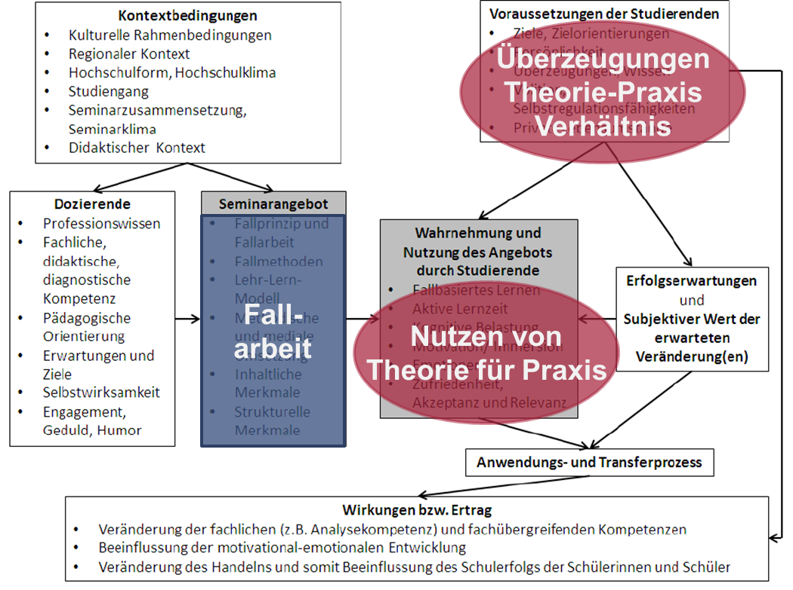
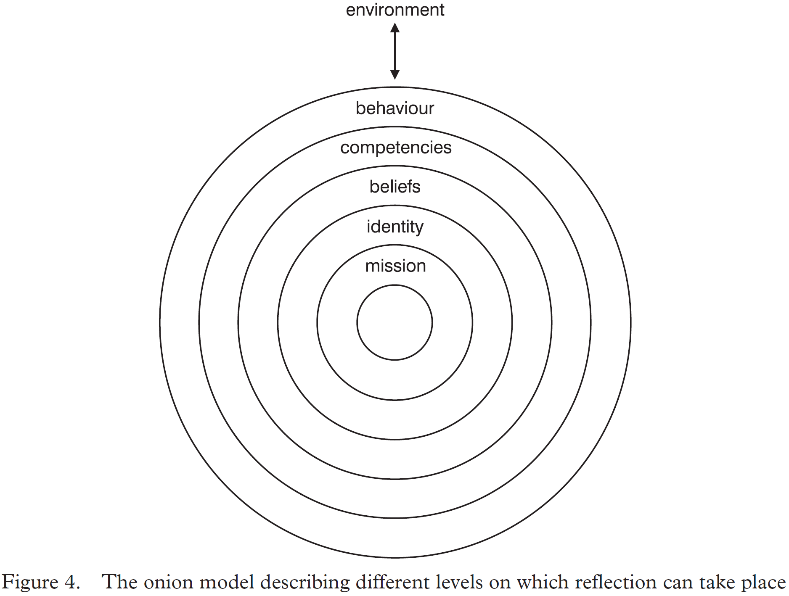
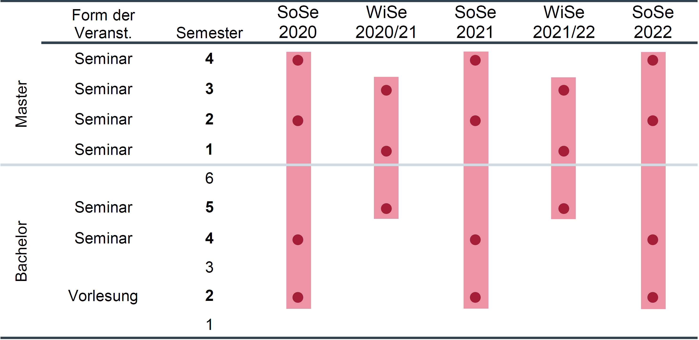
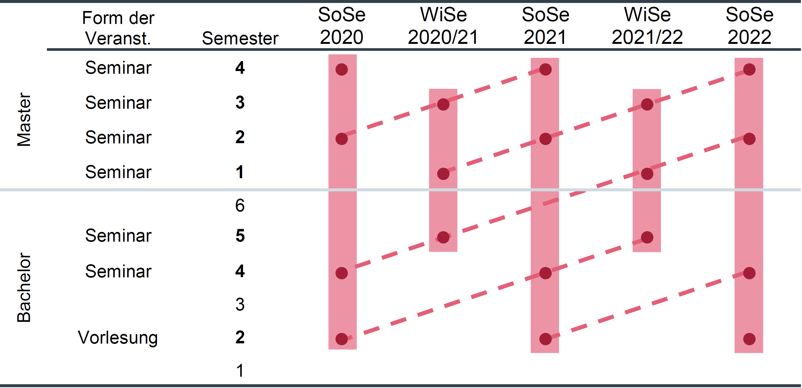

<style>
slides > slide:not(.nobackground):after {
  content: '';
}
</style>

```{r setup, include=FALSE}
knitr::opts_chunk$set(echo = FALSE)
library(shiny)
```


# Theoretischer Hintergrund

## Verhältnis von Theorie und Praxis | Relevanz in der Lehrerbildung

* "Dauerthema" Theorie-Praxis-Verhältnis<span class="mysource">[@Broekkamp.2007]</span><br /><br />
* Betrifft
  + mehrere Akteure <span class="mysource">[@Sturmer.2017; @Kunter.2014; @Knight.2015]</span>
  + mehrere Ebenen<span class="mysource">[@Fraefel.2017; @Reinhardt.2009]</span><br /><br />
* Fällt in Lehrveranstaltungen der ersten Phase zusammen

<div class="myfooter">
  Folien:  [osf.io/g8v7b](https://osf.io/g8v7b/)
</div>


<div class="notes">
Akteure kommen zusammen in den Rahmenbedingungen, die die Ebenen schaffen
</div>

## Integrieren oder unterscheiden? | Spannungsfeld Praxisnähe

* normative Orientierung der wissenschaftlichen Disziplin Schulpädagogik<span class="mysource">[@Bohl.2015]</span><br /><br />
* Bedürfnis von Lehramtsstudierenden <span class="mysource">[@Thon.2014]</span><br /><br />
* Wirksamkeit der Lehrerbildung <span class="mysource">[@Oser.2001]</span>
  
<div class="myfooter">
  Folien:  [osf.io/g8v7b](https://osf.io/g8v7b/)
</div>


<div class="notes">
sehr präsent: Praxisnähe

* ...an der Schulpraxis
* "pädagogische Wissenschaft dürfe nicht selbstzweck sein, sondern muss der pädagogischen Praxis nützen" Herzog, 2005
* die immer wieder Praxisnähe fordern. Was auch immer das aus ihrer Sicht bedeutet.
* (damit könnte man automatisch praxisnähe verbinden)

</div>
  
## Integrieren oder unterscheiden? | Integrieren!

__Rhetorik__

* "Verbindung"<span class="mysource">[@Moroni.2014]</span>
* "Verschränkung"<span class="mysource">[@Fischer.2018]</span>
* "Verzahnung"<span class="mysource">[@McGarr.2016]</span>
* "Brücke" über "Kluft"<span class="mysource">[@Gravett.2015]</span>
* ...

<br /><br /><br />
`r icon(name = "hand-point-right", lib = "font-awesome")` zentrales Problem der Lehrerbildung weltweit<span class="mysource">[@Korthagen.2010]</span><br /><br />

<div class="myfooter">
  Folien:  [osf.io/g8v7b](https://osf.io/g8v7b/)
</div>


<div class="notes">
Diese Brücke zu schlagen, sei nicht weniger als das zentrale Problem der Lehrerbildung weltweit
</div>

## Integrieren oder unterscheiden? | Unterscheiden!


* eigene Rationalitäten der Entitäten<span class="mysource">[@Terhart.1993]</span><br /><br />
* Vermeidung von Korrumpierung
  + Aufweichung der wissenschaftlichen Theorie<span class="mysource">[@Neuweg.2011]</span>
  + Dauerreflexion in/ Unterwerfung der Praxis<span class="mysource">[@Wernet.2016; @Neuweg.2017]</span><br /><br /><br />
  
`r icon(name = "hand-point-right", lib = "font-awesome")`  Frontenbildung? Theorie __vs.__ Praxis?


<div class="myfooter">
  Folien:  [osf.io/g8v7b](https://osf.io/g8v7b/)
</div>


<div class="notes">

* bspw. bezüglich ihrer Entstehung, Begründung und Verwendung
* bei einer scheinbar erfolgreichen Integration entweder die Wissenschaftlichkeit der Disziplin korrumpiert oder die Praxis vereinfachend der Wissenschaft unterworfen wird
* dass dem nicht so ist sehen wir gleich

</div>

## Taxonomien | [@Dewe.1992]

<div class = "container">
  <div class="box30">  
__Transfer__  
\
\

<span style="font-size:0.8em">Aus wissenschaftlichem Wissen werden __direkt__ Handlungsregeln abgeleitet.</span>
  </div>
  
  <div class="box30">  
__Transformation__  
\
\

<span style="font-size:0.8em">Wissenschaftliches Wissen wird für die Praxis in Handlungswissen __verändert__.</span>
  </div>
  
  <div class="box30">  
__Relationierung__  
\
\

<span style="font-size:0.8em">Wissenschaftliches Wissen und Handlungswissen als __zwei Perspektiven__ bei der Sinnkonstruktion konkreter Situationen.</span>
  </div>
</div>

<div class="myfooter">
  Folien:  [osf.io/g8v7b](https://osf.io/g8v7b/)
</div>


<div class="notes">

</div>

## {data-background=webs/modelle_tab.png data-background-size=contain}


<div class="notes">

</div>

## Taxonomien | [@Dewe.1992]



<div class="myfooter">
  Folien:  [osf.io/g8v7b](https://osf.io/g8v7b/)
</div>


<div class="notes">

</div>

## Taxonomien | [@Neuweg.2018b]


<span class="mysource">[@Neuweg.2010]</span>


<div class="myfooter">
  Folien:  [osf.io/g8v7b](https://osf.io/g8v7b/)
</div>

<div class="notes">

</div>


## Lehrerbildung | Modellannahmen & Mesoebene

* erste Phase der Lehrerbildung: __Universität__ vs. __Fachhochschule__<span class="mysource">[@Blomeke.2000]</span><br /><br />
* __Zusammenhang__ der Lehrerbildungsphasen<span class="mysource">[@Reinhardt.2009]</span><br /><br />
* Gestaltung von __Praxiserfahrungen__ innerhalb der ersten Phase<span class="mysource">[@Fraefel.2017]</span><br /><br />

<div class="myfooter">
  Folien:  [osf.io/g8v7b](https://osf.io/g8v7b/)
</div>


<div class="notes">
Modellvorstellungen bedingen (und rechtfertigen) Strukturen und Didaktik der Lehrerbildung

*
* Für die Ausbildung durch die Universität ist zu fordern, dass die Hochschullehrer nicht nur wissen, sondern auch können, also selbst ausgebildete Professionelle sind. Seminarausbilder wiederum müssen auch theorienah reflektieren können, also nicht bloß praktizieren.
* theoretisch-akademisch vs. praktisch-berufsvorbereitend 
</div>

## Lehrerbildung | Modellannahmen & Mikroebene

* z.B. Ausgestaltung didaktischer Arrangements<span class="mysource">[@Neuweg.2010]</span><br /><br />
* erste Phase besonders Gegenstand von Kontroversen<span class="mysource">[@Patry.2014]</span><br /><br /><br />

__QoL__: Qualitätsverbesserung des Bezugs von Theorie und Praxis<span class="mysource">[@BMBF.2014]</span>

<div class="myfooter">
  Folien:  [osf.io/g8v7b](https://osf.io/g8v7b/)
</div>


<div class="notes">

* aufgrund der bereits genannten Spannungsfelds "Praxisnähe"
* explizit als Ziel in der Qualitätsoffensive Lehrerbildung
</div>

## Lehrerbildung | Modellannahmen & Mikroebene

* vielbeachteter Ansatz: fallbasiertes Lernen<span class="mysource">[@Baecher.2018]</span><br /><br />
* unterschiedliche Ausgestaltung je nach Modellannahme
  + Transformation<span class="mysource">[@Seidel.2013]</span><br /><br />
  + Relationierung<span class="mysource">[@Leonhard.2016]</span>
  
<div class="myfooter">
  Folien:  [osf.io/g8v7b](https://osf.io/g8v7b/)
</div>


<div class="notes">

</div>

## Lehrerbildung | Angebot-Nutzungs-Modell

<span class="mysource">[@Syring.2016b]</span>

<div class="myfooter">
  Folien:  [osf.io/g8v7b](https://osf.io/g8v7b/)
</div>


<div class="notes">
Nutzung und der Erfolg des Lernangebots aber auch durch Merkmale der Lehramtsstudierenden, wie deren Überzeugungen, beeinflusst
</div>

## Lehrerbildung | Angebot-Nutzungs-Modell

<span class="mysource">[@Syring.2016b]</span>

<div class="myfooter">
  Folien:  [osf.io/g8v7b](https://osf.io/g8v7b/)
</div>


<div class="notes">

</div>

## Lehrerbildung | Überzeugungen

* beruhen auf dem Glauben einer Person<br /><br />
* potentiell impliziter und inkonsistenter Charakter<span class="mysource">[@Reusser.2014]</span><br /><br />
* Zusammenhang mit Wissen<span class="mysource">[@Dunekacke.2016]</span><br /><br />
* Einfluss auf Wahrnehmung<span class="mysource">[@Merk.2017]</span><br /><br />
* Einfluss auf Verarbeitung von Informationen<span class="mysource">[@Richter.2010]</span><br /><br />

<div class="myfooter">
  Folien:  [osf.io/g8v7b](https://osf.io/g8v7b/)
</div>


<div class="notes">
Veränderung im Einen bedingt aber nicht unbedingt Veränderung im Anderen
</div>

## Lehrerbildung | Überzeugungen: Stabilität

* Grad der __Vernetzung__ mit anderen Überzeugungen<span class="mysource">[@McAlpine.1996]</span><br /><br />
* __Zeitspanne__ seit Manifestierung<span class="mysource">[@Gooya.2007]</span><br /><br /><br />
`r icon(name = "hand-point-right", lib = "font-awesome")` eher stabil, aber nicht unveränderlich<span class="mysource">[@Haney.2002]</span>


<div class="myfooter">
  Folien:  [osf.io/g8v7b](https://osf.io/g8v7b/)
</div>


<div class="notes">

</div>

## Lehrerbildung | Überzeugungen: Stabilität

<br />
<span class="mysource">[@Korthagen.2005]</span>

<div class="myfooter">
  Folien:  [osf.io/g8v7b](https://osf.io/g8v7b/)
</div>


<div class="notes">

</div>

## Lehrerbildung | Überzeugungen: Veränderbarkeit

__Dissonante Information__<span class="mysource">[@Rule.2010]</span>

a. __Abgelehnung__ der Information
b. __Anpassung__ an die Überzeugungen 
c. __Veränderung__ der Überzeugung


<div class="myfooter">
  Folien:  [osf.io/g8v7b](https://osf.io/g8v7b/)
</div>


<div class="notes">

* (z.B. durch Leugnung der Dissonanz), (Information ist "unwahr" = Fake News)
* 
* aktiv-volitionale Auseinandersetzung:
* [sprachlich: wenn ich innovieren oder fortbilden möchte: erste zwei Pänomene problematisch]

</div>

## Lehrerbildung | Passung Angebot & Überzeugung

Überzeugungen von Studierenden  
_"verstellen einen analytischen Blick auf den ‚Fall‘ eher, als dass sie ihn eröffnen würden"_<span class="mysource">[@Thon.2016, S. 93]</span><br /><br /><br />

__Fehlende Passung__ zwischen Angebot & Überzeugung<span class="mysource">[@Thon.2014]</span>  
`r icon(name = "thumbs-down", lib = "font-awesome")` Ablehnung  
`r icon(name = "question-circle", lib = "font-awesome")` Verständigungsprobleme  
`r icon(name = "times-circle", lib = "font-awesome")` Lehrangebote als wenig nützlich empfunden


<div class="myfooter">
  Folien:  [osf.io/g8v7b](https://osf.io/g8v7b/)
</div>


<div class="notes">

* selbst bei den von Lehramtsstudierenden geforderten Lerngelegenheiten mit direktem Praxisbezug „eher Unzufriedenheit und Unsicherheit“ einstellen
* Wenn die von den Lehramtsstudierenden erwartete Funktionalität der Fallarbeit für Theorie und Praxis im Lehrangebot nicht eingelöst wird, führt dies zu Ablehnung oder Verständigungsproblemen im Lernprozess

</div>

## Lehrerbildung | Passung Angebot & Überzeugung

* Fallarbeit auf Basis unterschiedlicher Modellannahmen<span class="mysource">[@Leonhard.2016; @Seidel.2013]</span>
  + zwischen Lehrerbildungsstandorten
  + innerhalb von Lehrerbildungsstandorten<br /><br /><br />
`r icon(name = "question-circle", lib = "font-awesome")` Passung Angebot & Überzeugung?<br /><br />
`r icon(name = "question-circle", lib = "font-awesome")` Konvergenz/ Divergenz einen Effekt auf Wahnehmung des Lehrangebots?

<div class="myfooter">
  Folien:  [osf.io/g8v7b](https://osf.io/g8v7b/)
</div>


<div class="notes">
 -> wissen wir nicht, weil wir nicht wissen, welche Überzeugungen Lehramtsstudierene haben
</div>

## Lehrerbildung | Überzeugungen Lehramtsstudierender

```{r fischer, echo = F, fig.width=10, warning=F, comment=F, message=F}
fischerdata <- data.frame(zeitp = c("BA", "MA Prä", "MA Post", "BA", "MA Prä", "MA Post", "BA", "MA Prä", "MA Post"), 
                          variable = c("an", "an", "an", "um", "um", "um", "wi", "wi", "wi"),
                          value = c(3.71, 3.5, 3.38, 2.88, 3.15, 3.2, 2.08, 2.19, 2.32),
                          sd = c(.38, .62, .51, .54, .56, .67, .63, .57, .65)
                          )

library(tidyverse)
ggplot(fischerdata, aes(x = as.factor(zeitp), y = value, colour = as.factor(variable), group = as.factor(variable))) +
    geom_point(size = 3) +
    geom_line(size = 1) +
    # geom_errorbar(aes(ymin = value-sd, ymax = value+sd), width=.2,
    #               position=position_dodge(0.05)) +
    theme_minimal() +
    theme(
      # legend.position = "bottom",
      legend.title = element_blank()
    ) +
    scale_y_continuous(breaks = c(1, 2, 3, 4), 
                       minor_breaks = NULL,
                       expand = c(0.02,0),
                       limits = c(1,4), 
                       labels = c("stimmt\n nicht", "", "", "stimmt \n genau")) +
    scale_x_discrete(expand = c(0.02,0)) +
    labs(x = "Zeitpunkt", 
         y = "") +
    scale_color_manual(labels = c("Praxisbezug als\n Anschauungsvoraussetzung", "Umsetzbarkeit von\n Theorie in Praxis", "Unabhängigkeit von\n Theorie und Praxis"),
                       values = c("#D89000", "#00BFC4", "#e76bf3"))

```
<span class="mysource">[@Fischer.2016]</span>

<div class="myfooter">
  Folien:  [osf.io/g8v7b](https://osf.io/g8v7b/)
</div>


<div class="notes">
1) Praxis bezug als Anschauungsvoraussetzung (AN)
Vier Items, Beispielitem: «Fraxisbezug macht Theorie anschaulich.»
2) Umsetzbarkeit von Theorie in Praxis (UM)
Vier Items, Beispielitem: «Theorien müssen in praktisches Handeln umsetzbar
sein.»
3) Unabhängigkeit von Theorie und Praxis (WI)
Drei Items, Beispielitem: «Theorie und Praxis beziehen sich in der Regel nicht
aufeinander.»
</div>

## Lehrerbildung | Überzeugungen Lehramtsstudierender
```{r nausner1, echo = F, fig.width=6, warning=F, comment=F, message=F, fig.align="center"}

nausnerdata <- data.frame(zeitp = c(rep("STUD", 10), rep("HL", 10)), 
                          variable = c("Technologiekonzept", "Brillenkonzept", "Mutterwitzkonzept", "Prozeduralisierungskonzept", "Parallelisierungskonzept", "Erfahrungskonzept", "Meisterlehrerkonzept", "Interferenzkonzept", "Reflexionskonzept", "Persönlichkeitskonzept", "Technologiekonzept", "Brillenkonzept", "Mutterwitzkonzept", "Prozeduralisierungskonzept", "Parallelisierungskonzept", "Erfahrungskonzept", "Meisterlehrerkonzept", "Interferenzkonzept", "Reflexionskonzept", "Persönlichkeitskonzept"),
                          value = c(2.9, 3.0, 3.7, 2.9, 4.1, 3.7, 3.2, 3.2, 4.4, 4.0, 2.7, 2.9, 3.7, 2.8, 4.1, 3.6, 3.1, 3.0, 4.4, 4.1),
                          sd = c(0.7, 0.7, 0.5, 0.7, 0.6, 0.6, 0.7, 0.7, 0.6, 0.5, 0.8, 0.9, 0.5, 0.8, 0.7, 0.7, 0.8, 0.7, 0.6, 0.5)
                          )

ggplot(nausnerdata, aes(x = factor(zeitp, levels = c("STUD", "HL")), y = value, colour = as.factor(variable), group = as.factor(variable))) +
    geom_point(size = 3) +
    geom_line(size = 1) +
    # geom_errorbar(aes(ymin = value-sd, ymax = value+sd), width=.2,
    #                position=position_dodge(0.05)) +
    theme_minimal() +
    theme(
      #legend.position = "",
      legend.title = element_blank()
    ) +
    scale_y_continuous(breaks = c(1, 2, 3, 4, 5), 
                       minor_breaks = NULL,
                       expand = c(0.02,0),
                       limits = c(1,5), 
                       labels = c("stimmt\n nicht", "", "", "", "stimmt")) +
    scale_x_discrete(expand = c(0.02,0)) +
    labs(x = "Zeitpunkt", 
         y = "")

```
<span class="mysource">[@Nausner.2010]</span>

<div class="myfooter">
  Folien:  [osf.io/g8v7b](https://osf.io/g8v7b/)
</div>


## Lehrerbildung | Überzeugungen Lehramtsstudierender
```{r nausner2, echo = F, fig.width=6, warning=F, comment=F, message=F, fig.align="center"}

nausnerdata <- data.frame(zeitp = c(rep("STUD", 10), rep("HL", 10)), 
                          variable = c("Technologiekonzept", "Brillenkonzept", "Mutterwitzkonzept", "Prozeduralisierungskonzept", "Parallelisierungskonzept", "Erfahrungskonzept", "Meisterlehrerkonzept", "Interferenzkonzept", "Reflexionskonzept", "Persönlichkeitskonzept", "Technologiekonzept", "Brillenkonzept", "Mutterwitzkonzept", "Prozeduralisierungskonzept", "Parallelisierungskonzept", "Erfahrungskonzept", "Meisterlehrerkonzept", "Interferenzkonzept", "Reflexionskonzept", "Persönlichkeitskonzept"),
                          value = c(2.9, 3.0, 3.7, 2.9, 4.1, 3.7, 3.2, 3.2, 4.4, 4.0, 2.7, 2.9, 3.7, 2.8, 4.1, 3.6, 3.1, 3.0, 4.4, 4.1),
                          sd = c(0.7, 0.7, 0.5, 0.7, 0.6, 0.6, 0.7, 0.7, 0.6, 0.5, 0.8, 0.9, 0.5, 0.8, 0.7, 0.7, 0.8, 0.7, 0.6, 0.5)
                          )

ggplot(nausnerdata, aes(x = factor(zeitp, levels = c("STUD", "HL")), y = value, colour = as.factor(variable), group = as.factor(variable))) +
    geom_point(size = 3) +
    geom_line(size = 1) +
    # geom_errorbar(aes(ymin = value-sd, ymax = value+sd), width=.2,
    #                position=position_dodge(0.05)) +
    theme_minimal() +
    theme(
      #legend.position = "",
      legend.title = element_blank()
    ) +
    scale_y_continuous(breaks = c(1, 2, 3, 4, 5), 
                       minor_breaks = NULL,
                       expand = c(0.02,0),
                       limits = c(1,5), 
                       labels = c("stimmt\n nicht", "", "", "", "stimmt")) +
    scale_x_discrete(expand = c(0.02,0)) +
    labs(x = "Zeitpunkt", 
         y = "") +
    scale_color_manual(values = c("grey", "grey", "grey", "grey", "grey", "grey", "grey", "grey", "grey", "#FF62BC"))

```
<span class="mysource">[@Nausner.2010]</span>

<div class="myfooter">
  Folien:  [osf.io/g8v7b](https://osf.io/g8v7b/)
</div>


# Desiderat & Methode

## Desiderat

1. Fehlt: __Instrument__ mit zufriedenstellender psychometrischen Qualität
2. Unklar: __Ausprägung__ und __Entwicklung__ der Überzeugungen im Studium
3. Unklar: Effekte der __Interaktion__ zwischen Angebot und Überzeugung


<div class="myfooter">
  Folien:  [osf.io/g8v7b](https://osf.io/g8v7b/)
</div>


<div class="notes">
chronbachs Alpha von -.19 bis .59
</div>

## Studien

__Studie 1__  

* Entwicklung __Erhebungsinstrument__<br />
"Überzeugungen Lehramtsstudierender zum Verhältnis von Theorie und Praxis"  
\
\

__Studie 2__  

*	__Unterschiede__ in den Überzeugungen zwischen den Fachsemestern? _(Querschnitt)_  
*	__Veränderung__ der Überzeugungen im Studienverlauf? _(Längsschnitt, echtes Panel)_  
\
\ 
  
__Studie 3__  

* __Interaktion__ der Überzeugungen mit Lehrangeboten wirkt auf wahrgenommener Nutzen des Lehrangebots? _(Intervention)_


<div class="myfooter">
  Folien:  [osf.io/g8v7b](https://osf.io/g8v7b/)
</div>


<div class="notes">

1. Modelle Dewe et al.
1. inhaltlichen Mitarbeit: Ruben Kulcsar (Linz)
1. Stichprobenakquise: Thomas Fischer (Flensburg), Kathrin Rheinländer (Vechta)

</div>

## Studie 1 | Phasen der Instrumentenentwicklung

1. Definitionen Konstrukte<span class="mysource">[@Moosbrugger.2012]</span>
2. Itemformulierung
3. Pilotierung 1 + Itemselektion `r icon(name = "arrow-circle-left", lib = "font-awesome")`
4. Pilotierung 2 + Konstruktvalidierung


<div class="myfooter">
  Folien:  [osf.io/g8v7b](https://osf.io/g8v7b/)
</div>


<div class="notes">

</div>

## Studie 1 | 1. Definitionen (exemplarisch)

<div class = "container">
  <div class="box30">  
__Transfer__  
\
\

<span style="font-size:0.8em">Aus wissenschaftlichem Wissen werden __direkt__ Handlungsregeln abgeleitet.</span>
  </div>
  
  <div class="box30">  
__Transformation__  
\
\

<span style="font-size:0.8em">Wissenschaftliches Wissen wird für die Praxis in Handlungswissen __verändert__.</span>
  </div>
  
  <div class="box30">  
__Relationierung__  
\
\

<span style="font-size:0.8em">Wissenschaftliches Wissen und Handlungswissen als __zwei Perspektiven__ bei der Sinnkonstruktion konkreter Situationen.</span>
  </div>
</div>

Alle Definitionen [hier](https://docs.google.com/document/d/1vPSLtfQj2gr1f6uHHcXLS_R1QRj7xJtc9puoWeL0a80/edit?usp=sharing) zum Anschauen und Kommentieren.<span class="mysource">[@Radtke.2004]</span> 


<div class="myfooter">
  Folien:  [osf.io/g8v7b](https://osf.io/g8v7b/)
</div>


<div class="notes">

</div>


## Studie 1 | 2. Itemformulierung

* 9-12 Items pro Modell (68 Items)
* 6-stufige Likert-Skala
* "stimme gar nicht zu" ... "stimme voll zu"
* Demo des Fragebogens auf [showcase.formr.org](https://showcase.formr.org)
* Skalendokumentation auf OSF

<div class="myfooter">
  Folien:  [osf.io/g8v7b](https://osf.io/g8v7b/)
</div>


<div class="notes">

</div>

## Studie 1 | 3. Pilotierung 1 + Itemselektion

Skalendoku: [osf.io/tf8yv](https://osf.io/tf8yv/)

<div class="myfooter">
  Folien:  [osf.io/g8v7b](https://osf.io/g8v7b/)
</div>


<div class="notes">

</div>

## Studie 1 | 4. Pilotierung 2 + Konstruktvalidierung

__nächste Schritte__

* konvergente Konstruktvalidität
  + epistemische Konstrukte
  + Instrument Kulcsar
  + Instrument Thon & Fischer
* sensitiv für Unterschiede zwischen Semestern? 

<div class="myfooter">
  Folien:  [osf.io/g8v7b](https://osf.io/g8v7b/)
</div>


<div class="notes">
 zur Struktur und Sicherheit von Wissen
</div>

## Studie 2a | Design (Querschnitt)



<div class="myfooter">
  Folien:  [osf.io/g8v7b](https://osf.io/g8v7b/)
</div>


<div class="notes">

* erwartete Effektstärke: $\beta$ = .1217 [Quelle]
* Monte-Carlo-Simulation: Power von 80% für den Prädiktor „Semester“ auf alle sieben latenten Faktoren kann ab 700 Teilnehmenden
* Auswertung: Strukturmodell mit Prädiktor Semester

</div>


## Studie 2b | Design (Längsschnitt)




<div class="myfooter">
  Folien:  [osf.io/g8v7b](https://osf.io/g8v7b/)
</div>


<div class="notes">
* Auswertung: Latent Change Modells der within-person Messzeitpunkte
</div>

## Studie 3 | Design (Interventionsstudie)


* Intervention: Fallbasierte Seminarsitzungen basierend auf
  + Transformationsmodell
  + Relationierungsmodell
* Pre-Post-Design
  + Nutzen der Theorie für die Praxis
* Poweranalyse: N= 140 Studierende (kleiner bis mittlerer Effekt)
  
<div class="myfooter">
  Folien:  [osf.io/g8v7b](https://osf.io/g8v7b/)
</div>


<div class="notes">
FF: Konvergenz vs. Divergenz -> Nutzen der Theorie für die Praxis
</div>


# Vielen Dank | für die Aufmerksamkeit

__Jürgen Schneider__  
juergen.schneider@uni-tuebingen.de  
07071-29 76088  
[ORCID](https://orcid.org/0000-0002-3772-4198)

# Pictures
__title page__ | Sharon McCutcheon on unsplash.com


## Studie 3 | Interventionen

* __Relationierung__: Einlassung auf & Distanz zu Theorie & Praxis
  + Einlassung auf die Praxis: diese selbst zu erfahren, ohne dabei einem konstanten Reflexionszwang unterlegen zu sein
  + Einlassung auf Theorie: ohne Nützlichkeitsdruck auf Theorie einlassen
  + Distanz zu Praxis: ohne Handlungszwang Praxissituationen deuten
  + Distanz zu Theorie: Bedeutung und Grenzen der Theorien entdecken
  
* Transformation
  + z.B. subjektive Theorien
  
<div class="myfooter">
  Folien:  [osf.io/g8v7b](https://osf.io/g8v7b/)
</div>


<div class="notes">

</div>


#

