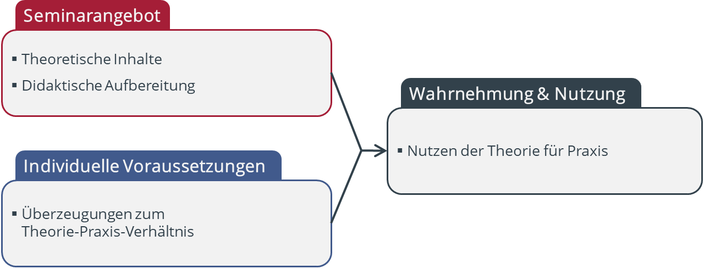
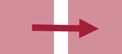

```{r setup, include=FALSE}
knitr::opts_chunk$set(echo = FALSE)
library(shiny)
```

## Worum geht es? | Überzeugungen beeinflussen Wahrnehmung der Lerninhalte

```{r }
# library(DiagrammeR)
# 
# grViz("
#     digraph {
#         node [shape = rectange, 
#               fixedsize = true, 
#               width = 3, 
#               height = 1, 
#               fontname = Helvetica,
#               color = white,
#               fontcolor = gray25]
#               
#         edge [color = gray35,
#               penwidth = 3]
#               
# 
#         # set nodes
#             ange [shape = plaintext, 
#                   fontsize = 20, 
#                   label = 'Lehrangebot', 
#                   style = filled, 
#                   fillcolor = honeydew3]
#             indiv [shape = plaintext, 
#                    fontsize = 20, 
#                    label = 'Individuelle \\n Voraussetzungen', 
#                    style = filled, 
#                    fillcolor = honeydew3]
#             theo [label = 'theoretische Inhalte', 
#                   style = filled, 
#                   fillcolor = honeydew2, 
#                   height = 0.5]
#             ueb [label = 'Überzeugungen \\n Theorie-Praxis-Verhältnis', 
#                  style = filled, 
#                  fillcolor = honeydew2, 
#                  height = 0.5]
#             dot [shape = point, 
#                  width = 0.01, 
#                  height = 0.01]  
#             umg [label = 'Umgang mit Lehrangebot']
#         
#         # set edges
#             subgraph {
#                 ange -> theo [color = White, arrowhead = none]
#             }
#         
#             subgraph {
#                 indiv -> ueb [color = White, arrowhead = none]
#             }
#         
#             {theo, ueb} -> dot [dir=none]
#             dot -> umg
#     }
# ")

```


## Welche Überzeugungen? | 3 Hauptmodelle
<div class = "container">
  <div class="box">  
__Transfer__  
\
\

<span style="font-size:0.8em">Aus wissenschaftlichem Wissen werden __direkt__ Handlungsregeln abgeleitet.</span>
  </div>
  
  <div class="box">  
__Transformation__  
\
\

<span style="font-size:0.8em">Wissenschaftliches Wissen wird für die Praxis in Handlungswissen __verändert__.</span>
  </div>
  
  <div class="box">  
__Relationierung__  
\
\

<span style="font-size:0.8em">Wissenschaftliches Wissen und Handlungswissen als __zwei Perspektiven__ bei der Sinnkonstruktion konkreter Situationen.</span>
  </div>
</div>


<div class="notes">
hierfür entwickeln wir einen FB, der mit Ihrer Hilfe erstellt werden kann
</div>


## Wie entwickeln sich diese Überzeugungen | ... im Studienverlauf?
```{r warning=F, message=F, fig.align='center'}
library(tidyverse)
plotdata <- tibble(Semester = rep(1:10, 3), 
                   y = c(c(5.2, 4.9, 4.7, 4.1, 3.4, 2.9, 2.5, 2.3, 2.2, 2.2), c(3.1, 3.0, 3.1, 3.4, 3.8, 4.3, 4.5, 4.8, 5.1, 5.2), c(2.2, 2.2, 2.3, 2.3, 2.4, 2.5, 2.7, 3.0, 3.3, 3.4)), 
                   ueb = c(rep("Transfer", 10), rep("Transformation", 10), rep("Relationierung", 10)))

ggplot(plotdata, aes(x=Semester, y=y, color=ueb)) + 
    geom_line(position = "identity", size=2) +
    theme_minimal() +
    theme(
      axis.text = element_text(size=16),
      axis.title = element_text(size=18, margin = margin(t = 50, r = 50), color = "darkgrey"),
      legend.position = "none"
    ) +
  scale_x_continuous(breaks = c(1:10)) +
  scale_y_continuous(breaks = c(1, 2, 3, 4, 5, 6), limits = c(1,6), labels = c("stimme gar \n nicht zu", "", "", "", "", "stimme \n voll zu")) +
  labs(x = "Semester", 
       y = "")


```